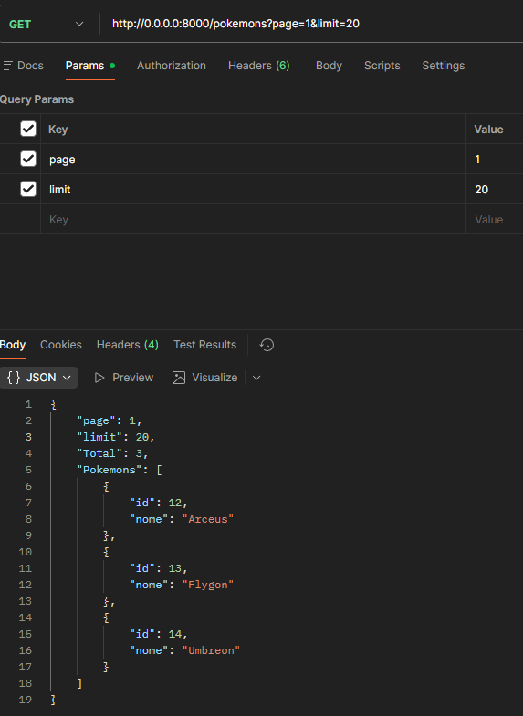
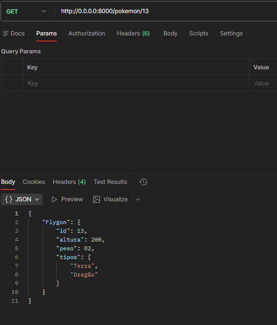
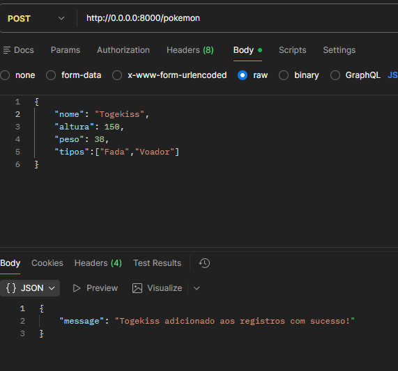
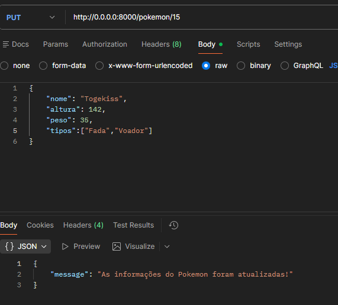
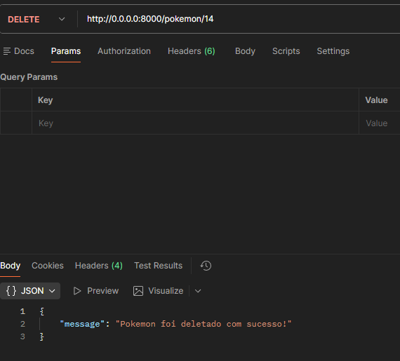

# API Pokemon
Uma API para realizar operações CRUD voltadas a catalogar pokemons, sendo possível manipular as informações dos pokemons em um banco de dados MySQL

# Instalação

## 1. Pré-requisitos
<ul>
<li>Docker/Podman</li>
<li>docker-compose/podman-compose</li>
</ul>

## 2. Clone o Reposítorio:
<ul>
<li> Utilize o comando no seu terminal <code>git clone https://github.com/Nanaya612/API-Pokemon</code>.</li>
<li> Depois utilize <code>cd API-Pokemon</code>.</li>
</ul>

## 2.5. Realização de Testes:

 Caso queira realizar os testes presentes no projeto para ter certeza do funcionamento basta utilizar o comando no terminal <code>pytest</code> e <code>pytest --cov=.</code>

## 3. Inicie a aplicação:
<ul>
<li>Utilize o comando no termial <code>podman machine init</code> ou <code>docker machine init</code> e depois <code>podman machine start</code> ou <code>docker machine start</code> para iniciar a máquina virtual</li>
<li> Depois utilize o comando <code>podman-compose up --build</code> ou <code>docker-compose up --build</code> para montar as imagens dos containers e rodar a aplicação. </li>
</ul>

## 4. Acessos:

Caso você tenha instalado a API e feito o passo a passo você pode acessar os endpoints como o <code>http://127.0.0.1:8000/pokemons</code> para retornar a lista de pokemons no banco de dados. Recomendo acessar o endpoint <code>http://127.0.0.1:8000/docs</code> para a documentação da API e seus endpoints.

Outra alternativa é acessar o link do deploy da API: "placeholder"

_para parar os serviços da api localmente utilize `podman-compose stop` ou `docker-compose stop` e para desligar e apagar os containers utilize `podman-compose down` ou `docker-compose down`_

# Exemplo de Requisições

<ul>
<li>
Acessando o endpoint <code>/pokemons</code> com método GET, é retornado a lista de pokemons armazenados no banco de dados, caso queira, você pode decidir a página e o limite de pokemons por página via parâmetros como page e limit.
</li>
<li>
Acessando o endpoint <code>/pokemon/{id}</code> com método GET, é retornado informações de um pokemon específico do banco de dados de acordo com seu id. 
</li>
<li>
Acessando o endpoint <code>/pokemon</code> com método POST, você pode adicionar pokemons ao registro do banco de dados, basta mandar as informações pelo body da requisição, sendo elas: nome, altura, peso, tipos.
</li>
<li>
Acessando o endpoint <code>/pokemon/{id}</code> com método PUT, você pode editar as informações de um pokemon ja registrado no banco de dados, so mandar as novas informações pelo body da requisição.
</li>
<li>
Acessando o endpoint <code>/pokemon/{id}</code> com método DELETE, você pode deletar um pokemon do banco de dados de acordo com seu id.
</li>
</ul>