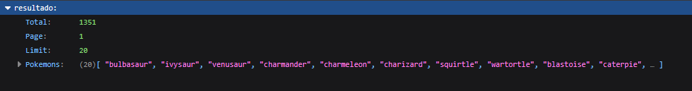
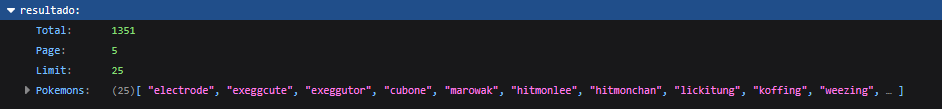
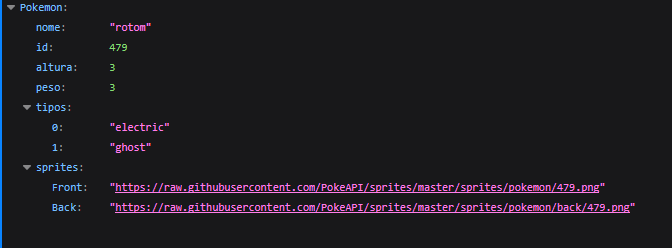

# API Pokemon
Uma API para listar todos os pokemons da Pokedex atual, também possue um endpoint para buscar informações de um pokemon específico de arcodo com o número da pokedex

# Instalação

## 1. Pré-requisitos
<ul>
<li>Docker/Podman</li>
<li>docker-compose/podman-compose</li>
</ul>

## 2. Clone o Reposítorio:
<ul>
<li> Utilize o comando no seu terminal <code>git clone https://github.com/Nanaya612/API-Pokemon</code>.</li>
<li> Depois utilize <code>cd API-Pokemon</code>.</li>
</ul>

## 2.5. Realização de Testes:

 Caso queira realizar os testes presentes no projeto para ter certeza do funcionamento basta utilizar o comando no terminal <code>pytest</code> e <code>pytest --cov=.</code>

## 3. Inicie a aplicação:
<ul>
<li>Utilize o comando no termial <code>podman machine init</code> ou <code>docker machine init</code> e depois <code>podman machine start</code> ou <code>docker machine start</code> para iniciar a máquina virtual</li>
<li> Depois utilize o comando <code>podman-compose up --build</code> ou <code>docker-compose up --build</code> para montar as imagens dos containers e rodar a aplicação. </li>
</ul>

## 4. Acessos:

Caso você tenha instalado a API e feito o passo a passo você pode acessar os endpoints <code>http://127.0.0.1:8000/pokemons</code> para a lista ou <code>http://127.0.0.1:8000/pokemons/{id}</code> para informações sobre um pokemon específico

Outra alternativa é acessar o link do deploy da API: https://api-pokemon-7h12.onrender.com

_para parar os serviços da api localmente utilize `podman-compose stop` ou `docker-compose stop` e para desligar e apagar os containers utilize `podman-compose down` ou `docker-compose down`_

# Exemplos de Requisições
<ul>
<li>
Acessando o endpoint <code>/pokemons</code> é retornado uma lista de pokemons:
</li>
<li>
Com o uso dos parâmetros page e limit é possivel ajustar a página exibida da lista e o limite de pokemons exibidos por página, como exemplo <code>/pokemons?page=5&limit=25</code>:
</li>
<li>
Acessando o endpoint <code>/pokemons/{id}</code>, onde o id é o número da pokedex do pokemon desejado, é retornado as informações deste pokemon:
</li>
